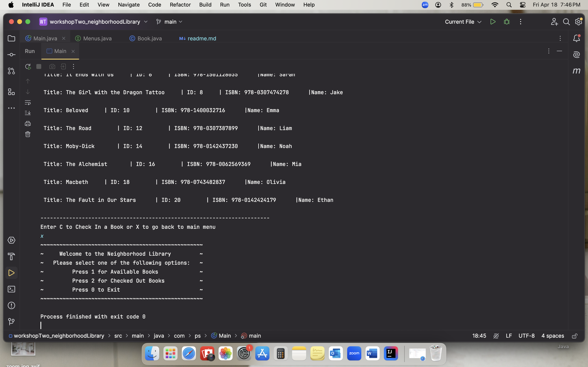

# Workshop 2

# Interesting Code
Instead of code, the concept of interface is interesting to me. I learned it in school and it is great for code invisibility. I remebered to use it here as my main menu was getting too crowded and i mostly had methods there.

# Main class

# Menus interface

# Book class

# Output for Available Books

# Output for Checked Out Books

# Output for Exiting
